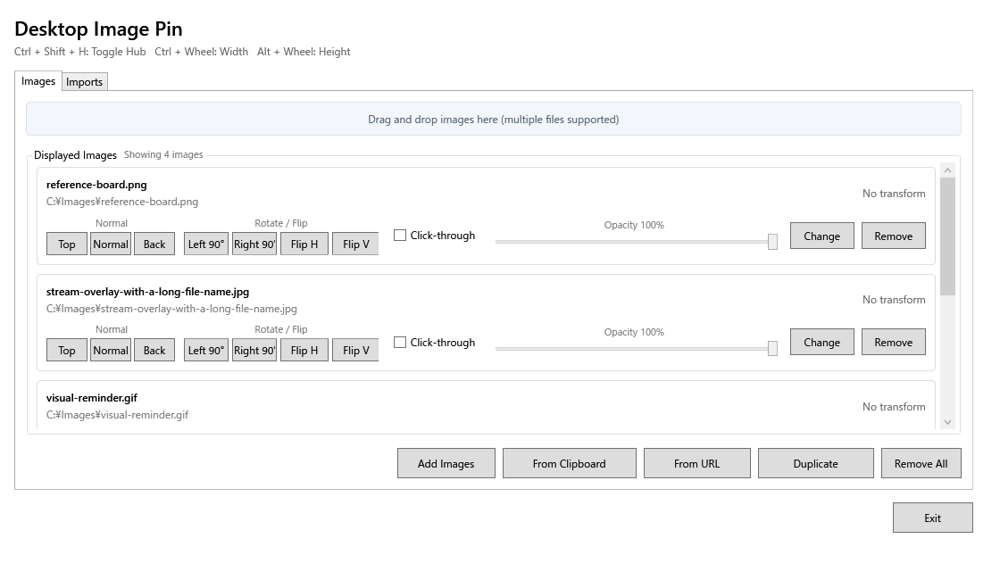

# Desktop Image Pin

[English README](README.md)

Desktop Image Pinは、画像を透明・枠なしの独立ウィンドウとしてWindowsデスクトップへ直接配置するツールです。資料作成中の参照画像、配信画面の飾り、視覚的なメモ、切り抜き画像、デスクトップ装飾などを、通常の画像ビューアの枠や単一キャンバスに縛られず表示できます。

一般的な画像ビューアとの違いは、各画像が独立して移動・拡大縮小・前後関係変更・クリック透過・変形・複製・復元できる点です。Hubから多数の画像をまとめて管理しつつ、表示画像そのものにはタイトルバーや枠を出しません。



## 主な機能

- 複数画像を透明・枠なしウィンドウとして表示
- 左ドラッグ移動、ホイール拡大縮小
- `Ctrl + ホイール`で横幅のみ、`Alt + ホイール`で高さのみ変更
- 大きな画像を初回表示時に作業領域の90%以内へ自動縮小
- 画像ごとの最前面・通常・背面表示
- クリック透過、透明度、90度回転、左右・上下反転
- 画像変更、複製、個別削除、全削除
- 複数ファイルのドラッグ＆ドロップ
- クリップボードとHTTP/HTTPS URLからの取り込み
- 名前付きURL画像をローカル保存し、毎回取得せず再利用
- 位置、縦横の拡大率、前後関係、透明度、変形、クリック透過を復元
- タスクトレイ常駐
- Windows起動時の自動起動
- `Ctrl + Shift + H`でHubを表示・非表示
- Hubに現在の表示枚数を表示

## 対応画像形式

PNG、JPEG、BMP、GIF、TIFFに対応します。GIFは先頭フレームのみ表示します。URL画像は25MBまでです。

## インストール

1. [最新のGitHub Release](https://github.com/shunufy/desktop-image-pin/releases/latest)から`DesktopImagePin.exe`をダウンロードします。
2. 任意のフォルダーへ配置します。
3. EXEをダブルクリックします。

配布EXEはWindows x64向け自己完結型なので、.NETランタイムの別途インストールは不要です。

## ソースから起動

Windows 10または11と.NET 8 SDKが必要です。

```powershell
git clone https://github.com/shunufy/desktop-image-pin.git
cd desktop-image-pin
dotnet restore DesktopImagePin.sln
dotnet run --project DesktopImagePin.csproj
```

## 操作方法

| 操作 | 方法 |
| --- | --- |
| 画像移動 | 左ドラッグ |
| 画像メニュー | 右クリック |
| 縦横比を保って拡大縮小 | マウスホイール |
| 横幅のみ変更 | `Ctrl + マウスホイール` |
| 高さのみ変更 | `Alt + マウスホイール` |
| Hub表示切り替え | `Ctrl + Shift + H` |
| Windows起動時に自動起動 | Hubの「Start Desktop Image Pin when Windows starts」を有効化 |
| クリック透過解除 | Hubから対象画像の設定を解除 |
| 完全終了 | Hubの「Exit」またはタスクトレイ |

Hubの**Images**タブで表示中画像を管理し、**Imports**タブで名前付きURL画像を保存・表示・再取得できます。

## 保存データ

```text
%LocalAppData%\DesktopImagePin\images.json
%LocalAppData%\DesktopImagePin\url-imports.json
%LocalAppData%\DesktopImagePin\ImportedImages\
```

`images.json`にはローカルファイルパスが含まれます。公開Issueへ添付する際は個人情報を削除してください。

自動起動設定を有効にした場合は、現在のユーザーの以下のレジストリ値にEXEパスを保存します。

```text
HKCU\Software\Microsoft\Windows\CurrentVersion\Run\DesktopImagePin
```

## 開発と保守

このプロジェクトは小規模なWindowsユーティリティとして継続保守します。安定性、分かりやすい操作、安全なローカル保存、依存関係を増やしすぎないことを優先します。今後の予定は[ROADMAP.md](ROADMAP.md)とGitHub Issuesで管理します。

ビルド・テスト方法は英語READMEと[docs/TESTING.md](docs/TESTING.md)を参照してください。

## ライセンス

[MIT License](LICENSE)です。
